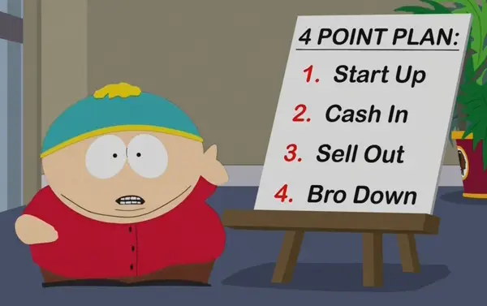

## Plan

I am building this app as a side project to help me optimize my daily life while working on other projects full-time.

I won't have the time to go super deep on any single task, so I'll have to make sure that each completed task makes the tool marginally more useful for myself... which is a smart way to work on projects regardless!

## High-Level Roadmap
- Build a "Quantum of Utility" for myself
- Ship a simple app and make it useful for one other person
- ???
- Profit

## Quantum of Utility
###### [What is a "Quantum of Utility"?](http://paulgraham.com/ds.html)

**Goal: Make a Tray Icon that toggles open with a shortcut and displays a graph w/ the various substances I intake.**

_Note: I've never built an electron app, so bear with me!_

_"menu bar" = "Tray" in Electron_

- `App Window` = Primary application window
- `Tray` = Menu bar
- `Tray Icon` = Menu bar icon
- `Tray Window` = Mini app window displayed under the `Tray Icon`

### Project Setup
- [x] Initialize the repo w/ a basic electron app from the [tutorial](https://www.electronjs.org/docs/latest/tutorial/quick-start)
- [x] Render a simple app window for when the app is running/launched
- [ ] Set up typescript
- [ ] Set up linting (prettier + eslint)
- [ ] Set up React
- [ ] Figure out how to hot-reload the app

### Basic `Tray Window` Functionality
- [ ] Make a simple tray icon
- [ ] Click on the tray icon to reveal an app window
- [ ] Reveal the tray app window with a system-level hotkey/shortcut e.g. `^⌘l` (hard-code this shortcut for now, will make customizable someday)
- [ ] Keep the app running to be used in the tray, even when all windows are closed
- [ ] Map `⌘q` & `⌘w` to close the `App Window` but keep the app running for the `Tray`
- [ ] Only show the `⌘tab` icon if the `App Window` is open (make sure it is hidden if `App Window` was closed)
- [ ] Fully quit the app for shortcut `^⌥⌘q` (same as 1password)
- [ ] Display an app window

### Read/Parse "Consumption File"
_NOTE: Still figuring out the format._

_Considering using SQLite, .yml, or my existing custom format. May end up writing scripts to export to different file formats eventually, so might be best to start off w/ SQLite if that's what the app ends up actually using._

### Display The Graph
**TODO**

